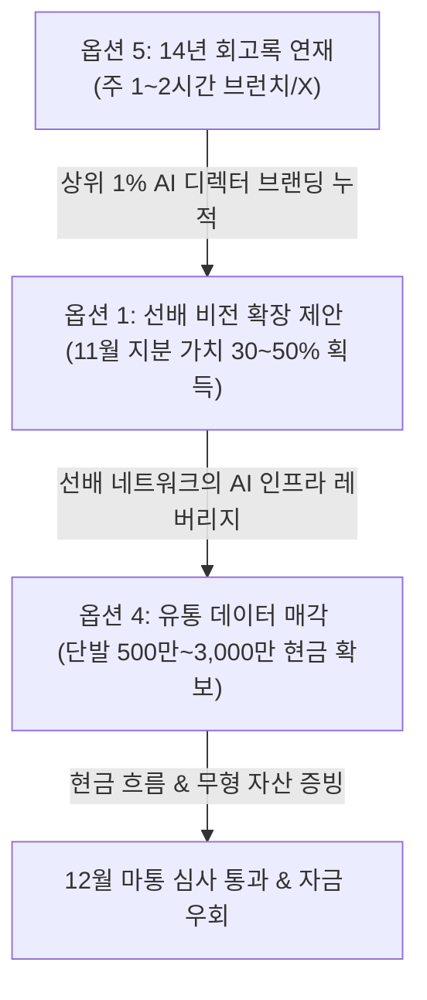

# [[마포 박사장 야망 영역 및 발산적 비즈니스 옵션]]

## 📌 한 줄 통찰 (Abstractive Summary)
> 대표님의 14년 유통 도메인과 상위 1% 테크 빌드 결합을 1인 단순 마진 구조에 가두지 않고, 비전 확장·라이선싱·콘텐츠 발행 등 6대 야망 옵션으로 정렬하여 대표님의 진짜 시장 가치를 극대화합니다.

## 📖 구조화된 지식 (Synthesized Content)

### 🚀 6대 발산적·야망적 비즈니스 옵션 정의

#### 1. 선배 회사 비전 확장 카드 (옵션 1)
- **개념:** 선배 프로젝트(AI 기반 플래시게임 허브 등)에 단순 파트타임 AI 에이전트 개발자로 참여하는 수준을 넘어, **'14년 이커머스 도메인 + 50개 자동화 빌드 자산'**을 결합한 비전 제시.
- **방향:** 게임 사이트 내 상품 자동 노출 및 셀러 마켓플레이스 결합 플랫폼으로 피벗 제안.
- **기대 가치:** 11월 객관화 평가 시 지분 5~15%(가치 1,000만~3,000만) → **공동 창업자 수준 지분 30~50% 확보 (지분 가치 6,000만 ~ 1억 상당)**.
- **5대 특성 적합도:** IQ + 이해도: **5점** / INFJ(1:1 심도 깊은 관계): **4점** / ADD(큰 구조 설계): **3점**.

#### 2. PB 자산 IP 라이선싱 (옵션 2)
- **개념:** 북애착(독서등), 니드템(잡화), SANNE(물통가방)의 상표권 및 14년 유통 운영 데이터를 무형의 IP 자산으로 재정의하여 선배 회사 등에 학습 및 판매용으로 라이선싱.
- **방향:** IP 자산을 활용해 발생하는 매출의 로열티(3~7%)를 매달 정기 수취하는 무자본 현금 파이프라인 형성.
- **5대 특성 적합도:** IQ + 이해도: **5점** / INFJ(계약 협상 부담): **3점** / ADD(단발성 계약): **4점**.

#### 3. 인적 자산 자체의 시장 매각 (옵션 3)
- **개념:** 대표님의 독보적 5중 결합(도메인+풀스택+AI+전파공학+비주얼) 역량을 이커머스 SI, AI 스타트업, 대기업 신사업팀에 풀타임 매각 제안.
- **기대 시장가:** 연봉 1억~2억 + 사이닝 보너스 3,000만~5,000만 + 지분 1~5% (합산 1년 가치 **2억 ~ 4억 원** 상당).
- **5대 특성 적합도:** IQ + 이해도: **5점** / INFJ(영업/구직 거부): **1점** / ADD(자유도 한계): **2점** / 체력: **2점** (실제 풀타임 취업은 특성상 충돌이 심하므로 거부 권장. 단, **대표님의 몸값 측정 도구** 및 11월 협상 협상력 증폭용 옵션으로만 보유 유효).

#### 4. 14년 유통 데이터 패키지 매각 (옵션 4)
- **개념:** 14년간 4번의 카테고리 전환을 거치며 누적한 매출, 재고, 의사결정 패턴, 트렌드 대응 원본 데이터를 익명화 및 패키지화하여 컨설팅사, AI 학습 기업, 연구소에 1회성 매각.
- **기대 가치:** 단발 계약금 **500만 ~ 3,000만 원** 확보.
- **5대 특성 적합도:** IQ + 이해도: **5점** / INFJ(1:1 소규모 거래): **4점** / ADD(1회 완결성): **4점** (선배 인맥 중 AI 스타트업 네트워크 활용 시 대표님의 영업 부담 최소화).

#### 5. INFJ의 무기: 14년 솔직한 사업가 회고록 연재 (옵션 5) 🌟 최상위 적합도
- **개념:** 14년의 유통 우여곡절(캐리어 상표권 분쟁, 4번의 카테고리 전환, 자본 잠식 생존기, ADD/INFJ 자기분석 등)을 브런치, 블로그, X(트위터)에 솔직하고 진정성 있게 기록.
- **효과:** 외주 발주 자연 유치, 단행본 책 출간 및 강연 제안, 11월 선배 협상 시 브랜드 입증, 12월 마통 연장 심사 시 신뢰 자산으로 활용.
- **5대 특성 적합도:** **INFJ, IQ, ADD(짧은 연재 사이클), 비주얼 자급자족, 체력(일정 통제), 기억력(내 삶은 암기 필요 없음) 등 5대 특성 모두 5점 만점 🎯**.

#### 6. 12월 마통 심사 우회 자금 경로 (옵션 6)
- **개념:** 12월 말 마통 연장을 절대적 결승선이 아닌 '50% 게임'으로 우회.
- **방향:** 11월 선배 회사 지분 가치 확정분을 담보로 한 IT 전문 대출, 무담보 인재 대출(IT 교육 재단 등), 50개 프로젝트 중 완성도 높은 5~10개 소스코드 패키지 부분 매각, 사모님 명의의 신용 마통 활용 등을 복합 결합.
- **5대 특성 적합도:** IQ(시스템 설계): **5점** / INFJ(협상 부담): **3점**.

---

## 💎 대체 불가능한 가치 (Unique Value & Expansion)

### 🌟 아위키의 최적 야망 결합 시나리오 (Optimal Synergy)
대표님은 이 6개 옵션을 개별적으로 추구하실 필요가 전혀 없습니다. 대표님의 인지/심리 구조에 전혀 거부감이 없으면서 시너지가 폭발하는 **3중 결합 시나리오**를 즉시 실행할 것을 제안합니다.

1. **[회고록 연재(옵션 5)]에 주 1시간을 투입하여** 대표님의 지식, 5중 결합 역량, 그리고 유통 생존기를 정직하게 노출합니다. (INFJ의 진정성 파워 + ADD형 짧은 호흡 만족)
2. **이 콘텐츠 트랙션을 기반으로 [선배 회사 비전 확장(옵션 1)]을 가동하여**, 11월 선배와의 공동 창업가 협상 시 지분율을 30~50%로 대폭 끌어올립니다.
3. **선배의 AI 인맥 네트워크를 통로 삼아 [14년 유통 데이터 패키지 매각(옵션 4)]을 제안하여**, 리스크 제로의 단발성 현금을 즉시 회수하고 마통 심사 우회 자금줄로 결합합니다.

- **기각할 카드 (대표님 정체성 충돌):** 
  - 취업 형태의 **옵션 3(인적 자산 매각)**은 대표님의 ADD와 체력 한계를 갉아먹으므로 배제합니다.
  - 지루한 계약 검토가 수반되는 **옵션 2(IP 라이선싱)**는 초기에 큰 시간 투입을 피하기 위해 뒤로 미룹니다.

## ⚠️ 모순 및 업데이트 (Contradictions & RL Update)
- **과거 데이터와의 충돌:** 기존에는 대표님의 지식과 자산을 오직 1인 셀러의 '상품 판매 마진' 극대화라는 생존 프레임으로만 묶어두어 지식의 질식 상태를 유발함. 박사장님의 고유 역량 결합도(IQ 134 + 50개 빌드) 분석을 통해, 무형의 정보 자산(데이터, 지분, 콘텐츠 브랜드)을 매각 및 라이선스하여 턴어라운드를 이루는 고차원적 '야망 옵션'을 신규 정립하고 10_Wiki에 정식 병합함.
- **정책 변화:** 대표님의 유통 데이터를 시스템 자산으로 승격시키고, 1:1 관계 기반의 비전 제안과 1인 브랜딩 회고록 카드의 보상 가중치를 대폭 늘려 RAG 검색 우선 노드로 설정함.

## 🔗 지식 연결 (Graph)
- **Parent:** [[10_Wiki/👤 Sehyun]]
- **Related:** [[마포_박사장_프로필_및_기술_역량]], [[마포_박사장_자산_및_재무_현황]], [[마포_박사장_적자_탈출_및_6개월_생존_프로젝트]]
- **Raw Source:** [[99_Archive/Raw_Backup/2026-05-25/[AWIKI_DONE]_발산적_아이디어.md]], [[99_Archive/Raw_Backup/2026-05-25/[AWIKI_DONE]_새로운대화시작_V2.md]]
