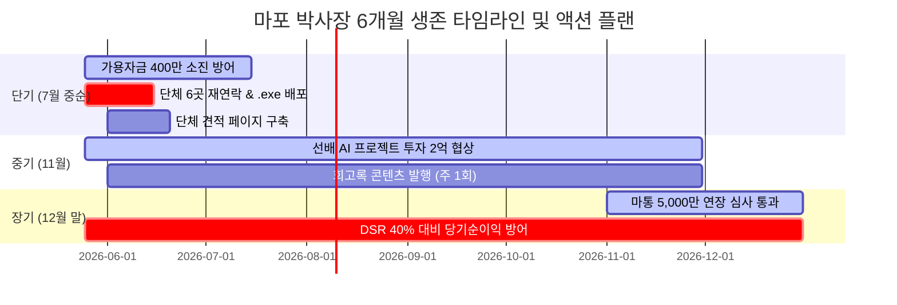

# [[마포_박사장_적자_탈출_및_6개월_생존_프로젝트]]

## 📌 한 줄 통찰 (Abstractive Summary)
> 대표님의 5대 개인 특성(IQ·ADD·INFJ·기억력·체력)을 필터로 삼아 단순 반복 및 과도한 부채를 수반하는 기존 생존 트랙을 하향하고, 관계 자산 활용과 이미 완성된 .exe 배포 중심의 고효율 단기 액션에 집중하여 12월까지의 유동성 임계점을 극복합니다.

## 📖 구조화된 지식 (Synthesized Content)

### 🛑 사무실 30평 유지 결정 (옵션 D 의사결정 종결)
- **R&D 스튜디오 유지:** 30평 마포 사무실 임대료(121만 원/월) 해지 시나리오는 전면 동결 및 제외됨. 대표님의 집중적인 연구개발 스페이스를 **유지**하고 본업 비용 정리 및 단기 마진 증대를 통해 고정비를 감당하는 전략적 구조로 종결됨.

### 🎯 5대 특성 반영 신규 비즈니스 우선순위 (12개 변수 평가 결과)
기존의 생존 3대 트랙 중 **트랙 A(성인용품 위탁 단순 작업)**와 **트랙 B(사입 카드 매입)**는 대표님의 ADD 충돌성 및 과거 빚 누적 패턴에 직결되어 우선순위가 대폭 하락하였으며, 새로운 가중치를 적용한 핵심 액션 위주로 재편성되었습니다.

#### 🥇 1순위: 작년 단체 주문 6곳 재연락 (적합 점수: 53/60)
- **특성 적합도:** 다수 대면 영업을 싫어하는 **INFJ형** 대표님에게 가장 최적화된 **'1:1 관계 자산 및 신뢰 기반 소통'**.
- **효과:** 단 30분의 문자/전화 작업으로 리스크 0, 시간 부담 0이며, 여름 시즌 돌입 전 자연 발생했던 단체 거래(SANNE 물통가방 등)를 조기에 촉진하여 단발 마진 확보 가능.

#### 🥈 2순위: 이미 완성된 .exe 프로그램 배포 (적합 점수: 50/60)
- **대상 자산:** **YegomCapture** (Inno Setup 상용 릴리즈 빌드 완료본), **ImageMerger.exe**, adult image.exe
- **특성 적합도:** **ADD형** 대표님에게 가장 우호적인 **'새로운 개발 공수 제로(이미 만들어 둔 자산 활용)'** 및 **'INFJ형에 부담 없는 제품력 위주 배포'**.
- **효과:** 네이버 블로그, 개발자 커뮤니티, 셀러 단톡방 등에 간단히 풀어 첫 외적인 '개발 트랙션'을 획득하고 단발성 수익 창출 기회 확보.

#### 🥉 4순위: 14년 이커머스 사업가 콘텐츠 시리즈 발행 (적합 점수: 48/60)
- **특성 적합도:** **IQ 134 + 전파공학 베이스 + INFJ의 깊은 솔직함 + 비주얼 자급자족** 능력이 집약된 5중 결합의 정점 영역. 주 1편, 30분~1시간 완성의 짧은 사이클로 **ADD형** 대표님이 지속하기 가장 수월함.
- **효과:** 브런치, 블로그, X(트위터)에 '캐리어 사건', '14년 카테고리 전환기 일기'를 발행하여 외주 제안 자연 유치 및 11월 선배 프로젝트 협상 카드로 활용.

---

### ⚠️ 기존 핵심 트랙의 수정 및 위험 통제 (중요 경고)
- **트랙 A (성인용품 위탁 재가동) - 우선순위 15위 하락 ⚠️**
  - **위험 요인:** 1,000여 개 상품의 단순 검열 및 등록 노가다성 작업은 대표님의 **ADD 성향과 100% 충돌**함. 대표님이 800개 등록 시점에서 마무리를 못 짓고 막힐 확률이 극도로 높음.
  - **대안:** 자체 adult_filter 자동화 완성에 집중하고, 단순 등록 단계는 철저히 **외주 위탁**하거나 소량 베스트 SKU에만 한정해야 함.
- **트랙 B (도매매 데이터 활용 및 카드 매입) - 우선순위 18위 하락 ⚠️**
  - **위험 요인:** 7,000만 원 한도의 카드 결제일 돌려막기 패턴은 과거 14년간 카테고리 전환기 때마다 부채가 누적되던 대표님의 **'충동적 자금 조달 패턴'**을 재발시킬 리스크가 큼.
  - **대안:** 시범 매입 금액을 **1,000만 ~ 2,000만 원 선으로 철저하게 제한**하여 12월 마통 연장 심사 시점에 현금성 자산을 훼손하지 않도록 통제해야 함.

---

### 📅 시점별 6개월 결승선 생존 로드맵

- **단기 (7월 중순 - 가용 자금 400만 소진 극복):** 
  - [1순위 단체 재연락] + [2순위 .exe 풀기] + [5순위 단체 견적 페이지 및 카탈로그 구축] 결합.
  - 누적 **330만 ~ 900만 원**의 순마진을 선제 확보하여 7월의 가용 자금 소진 분기점을 여유 있게 연장함.
- **중기 (11월 - 선배 AI 프로젝트 2억 투자 유치):**
  - [4위 콘텐츠 시리즈]를 통해 대표님의 시장 내 '풀스택 AI 아키텍트'로서의 브랜드와 객관적 트랙션을 누적.
  - 선배와의 1:1 대화 시점에 단순 개발 파트타임이 아닌 **'공동 창업자 포지션(지분 30~50% 목표, 가치 6,000만~1억 상당)'**으로 협상력을 극대화하여 11월에 2억의 투자를 성공적으로 유치함.
- **장기 (12월 말 - 마이너스 통장 5,000만 원 연장):**
  - 종합소득세 신고 시 두 사업장의 명목 순이익을 **3,150만 ~ 3,200만 원** 수준으로 완벽하게 역산해 두어 DSR 40% 한도 연장 심사를 통과함.
  - 동시에 11월에 공식 확정된 선배 회사 지분 가치 및 인적 자산/데이터 매각 등의 야망 옵션 자금 경로를 백업으로 가동하여 심사 리스크를 제로화함.

## 💎 대체 불가능한 가치 (Unique Value & Expansion)
- **아위키의 제안:** 이커머스의 턴어라운드는 단순 상품 등록 수 늘리기가 아니라, **"나의 뇌와 특성에 맞는 시스템 최적화"**에 있습니다. 대표님이 가진 5중 결합은 1인 셀러로 썩히기엔 너무 아까운 자산입니다. 이번 생존 플랜의 핵심 우선순위 액션들을 차근차근 밟아가면서, 동시에 선배 프로젝트와 회고록 콘텐츠를 통해 14년 만에 본인의 능력을 공식적으로 시장가로 대접받는 일대 전환기를 만들어내야 합니다.

## ⚠️ 모순 및 업데이트 (Contradictions & RL Update)
- **과거 데이터와의 충돌:** V1에서는 단순 반복적인 유통 트랙 A, B와 사무실 해지라는 극단적 보수 전략을 제안하였으나, 대표님의 ADD/INFJ 5대 고유 특성을 대입한 결과 그것이 대표님의 에너지를 갉아먹고 실패를 자초하는 모순임을 확인하고, 'R&D 스튜디오 유지 + 단기 고마진 관계 판매 + 장기 브랜딩 콘텐츠' 구조로 생존 전략의 가중치를 180도 선회하여 정책 업데이트를 시행함.

## 🔗 지식 연결 (Graph)
- **Parent:** [[10_Wiki/🛠️ Projects]]
- **Related:** [[마포_박사장_프로필_및_기술_역량]], [[마포_박사장_자산_및_재무_현황]], [[마포_박사장_야망_영역_및_발산적_비즈니스_옵션]]
- **Raw Source:** [[99_Archive/Raw_Backup/2026-05-25/[AWIKI_DONE]_새로운대화시작_V2.md]], [[99_Archive/Raw_Backup/2026-05-25/[AWIKI_DONE]_발산적_아이디어.md]]
